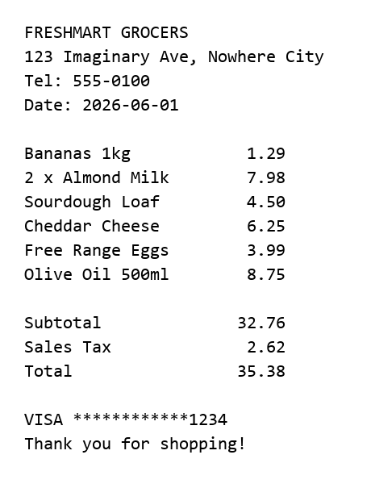

# Local Receipt Parser

> Upload a receipt image or PDF, extract items, totals and taxes, and export a clean CSV — all locally, nothing leaves your machine.


Local Receipt Parser is a small **Streamlit** app that runs OCR on a receipt,
parses out the merchant, date, line items, subtotal, tax and total, lets you
review them in a table, and exports the result to CSV. OCR runs through your
choice of **Tesseract** (local/offline), the **OpenAI Vision API**, or the
**Google Cloud Vision API**.

It ships with **fully fictional sample receipts** so you can demo it safely
without exposing any real personal or financial data.



## Features

- 🧾 **Image & PDF input** — PNG/JPG/TIFF/BMP and PDF (text or scanned).
- 🔌 **Pluggable OCR** — pick **Tesseract** (local), **OpenAI Vision**, or
  **Google Cloud Vision** from the sidebar; the app falls back gracefully when
  a backend isn't configured.
- 🔒 **Local-first** — Tesseract processes images in memory and uploads nothing.
  API backends only send the image when you explicitly select them.
- 📦 **Structured extraction** — merchant, date, per-line items with quantities,
  subtotal, tax, and total.
- ✅ **Sanity check** — warns when line items don't sum to the printed subtotal.
- ⬇️ **CSV export** — one click, tidy output ready for a spreadsheet.
- 🧪 **Demo-safe samples** — three fake receipts (grocery, cafe, hardware) that
  work even before you install Tesseract.

## Quickstart

```bash
git clone https://github.com/wenweilee12345/local-receipt-parser.git
cd local-receipt-parser

python -m venv .venv
# Windows:  .venv\Scripts\activate
# macOS/Linux: source .venv/bin/activate

pip install -r requirements.txt
streamlit run app.py
```

Then open the URL Streamlit prints (usually <http://localhost:8501>), choose a
sample under **Try a sample**, and click **Parse**.

## Installing Tesseract

`pytesseract` needs the Tesseract binary on your system:

| Platform | Command |
|----------|---------|
| Windows  | `winget install UB-Mannheim.TesseractOCR` (or the [UB Mannheim installer](https://github.com/UB-Mannheim/tesseract/wiki)) |
| macOS    | `brew install tesseract` |
| Ubuntu   | `sudo apt-get install tesseract-ocr` |

> The bundled samples ship with their ground-truth text, so **Try a sample**
> still works even if Tesseract isn't installed yet — handy for a first look.

## OCR backends

Choose the engine in the sidebar. Tesseract works out of the box; the API
backends are optional and only used when selected.

| Backend | Install | Configure | Notes |
|---------|---------|-----------|-------|
| **Tesseract** | see table above | — | Local, offline, free, private. Default. |
| **OpenAI Vision** | `pip install -r requirements-api.txt` | `OPENAI_API_KEY` (optional `OPENAI_OCR_MODEL`, default `gpt-4o-mini`) | Strong on photos/skewed receipts. Sends the image to OpenAI. |
| **Google Cloud Vision** | `pip install -r requirements-api.txt` | `GOOGLE_APPLICATION_CREDENTIALS` → your service-account JSON | Excellent dense-text OCR. Sends the image to Google. |

Set the variables before launching Streamlit, e.g. on Windows PowerShell:

```powershell
$env:OPENAI_API_KEY = "sk-..."
streamlit run app.py
```

```bash
# macOS/Linux
export GOOGLE_APPLICATION_CREDENTIALS=/path/to/key.json
streamlit run app.py
```

Programmatic use:

```python
from src.ocr import extract_text
text = extract_text("receipt.jpg", open("receipt.jpg", "rb").read(), backend="openai")
```

## Usage

```text
1. Pick "Try a sample" or "Upload your own".
2. Click Parse.
3. Review the extracted merchant, date, items, and totals.
4. Click "Download CSV".
```

### CSV output

```csv
merchant,FRESHMART GROCERS
date,2026-06-01
currency,$

description,quantity,price
Bananas 1kg,1,1.29
Almond Milk,2,7.98
...

subtotal,,32.76
tax,,2.62
total,,35.38
```

## Project structure

```
local-receipt-parser/
├── app.py                  # Streamlit UI
├── requirements-api.txt    # optional deps for OpenAI / Google backends
├── src/
│   ├── ocr.py              # image / PDF -> text (Tesseract / OpenAI / Google)
│   ├── parser.py           # text -> structured Receipt (OCR-agnostic)
│   └── export.py           # Receipt -> CSV
├── samples/
│   ├── generate_samples.py # rebuild the fake receipts
│   └── *_receipt.png/.txt  # fictional demo receipts + ground truth
└── tests/test_parser.py    # parser unit tests (no Tesseract needed)
```

## Use as a library

```python
from src.parser import parse_receipt
from src.export import receipt_to_csv

receipt = parse_receipt(open("samples/grocery_receipt.txt").read())
print(receipt.merchant, receipt.total)     # FRESHMART GROCERS 35.38
print(receipt_to_csv(receipt))
```

## Development

```bash
pip install pytest
pytest -q                              # run the parser test suite
python samples/generate_samples.py     # rebuild sample receipts
```

The parser is intentionally decoupled from OCR, so the test suite runs on plain
text and needs neither Tesseract nor any image.

## Privacy & safety

All processing is local. The repository contains **only fictional** receipts —
every store name, address, and card number is made up. Real uploads are
processed in memory and are git-ignored if ever saved.

## License

[MIT](LICENSE)
